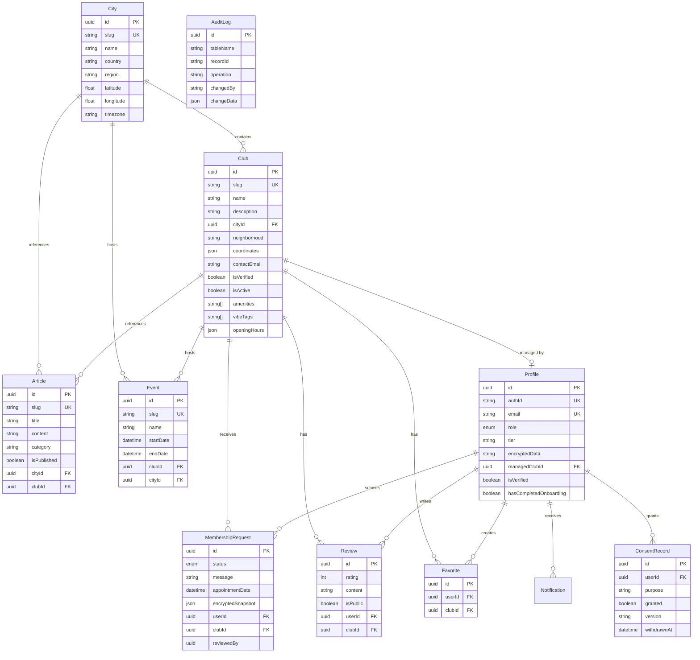
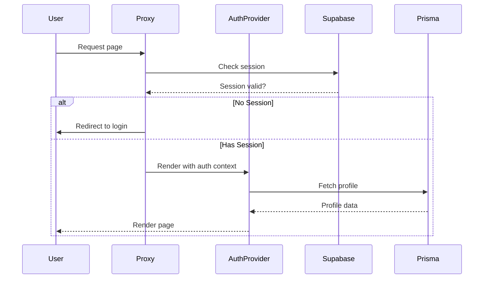
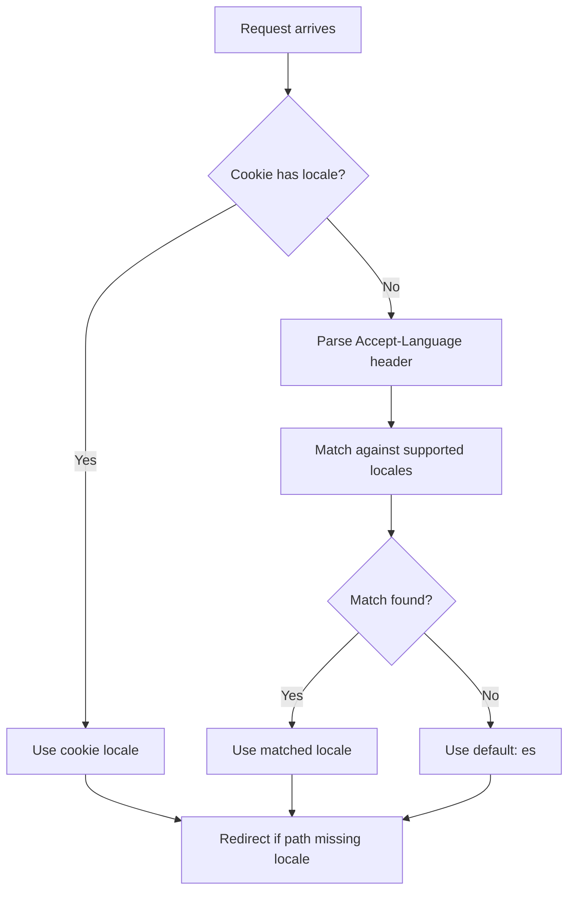
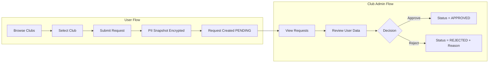
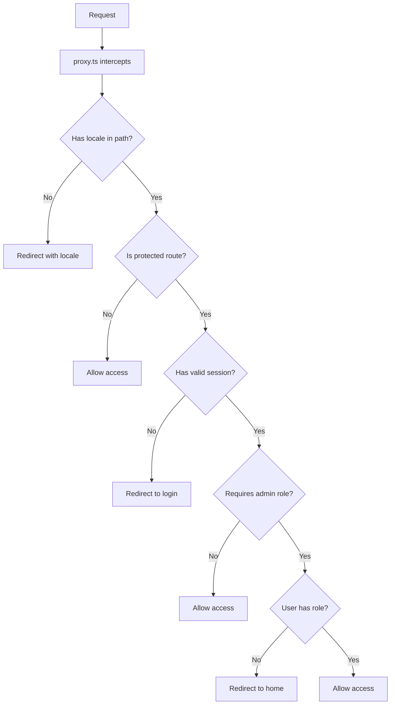

# Cannabis Social Club Platform - Architecture Schema

**Version:** 3.0  
**Date:** February 2026  
**Framework:** Next.js 16 (App Router)  
**Database:** PostgreSQL (Supabase) + Prisma 7  

---

## Table of Contents

1. [System Overview](#system-overview)
2. [Architecture Diagram](#architecture-diagram)
3. [Layer Breakdown](#layer-breakdown)
4. [Data Models](#data-models)
5. [Security Architecture](#security-architecture)
6. [Internationalization](#internationalization)
7. [Key Data Flows](#key-data-flows)
8. [Component Library](#component-library)
9. [Implementation Status](#implementation-status)
10. [Remaining Work](#remaining-work)

---

## System Overview

This document provides a comprehensive surgical schema of the Cannabis Social Club Platform, mapping all connections between layers, components, and data flows.

### Tech Stack

| Category | Technology |
|----------|------------|
| **Framework** | Next.js 16 (App Router) |
| **Edge Layer** | proxy.ts (replaces middleware) |
| **Database** | PostgreSQL via Supabase |
| **ORM** | Prisma 7 with pg adapter |
| **Authentication** | Supabase Auth + SSR |
| **Encryption** | AES-256-GCM (Node.js crypto) |
| **UI Library** | shadcn/ui + Radix UI |
| **Styling** | Tailwind CSS |
| **Animation** | Framer Motion + GSAP + Lenis |
| **Forms** | React Hook Form + Zod |
| **Testing** | Vitest + Playwright |
| **i18n** | Custom (8 locales) |

---

## Architecture Diagram

```mermaid
%%{init: {
  'theme': 'base',
  'themeVariables': {
    'primaryColor': '#10b981',
    'primaryTextColor': '#fff',
    'primaryBorderColor': '#059669',
    'lineColor': '#6b7280',
    'secondaryColor': '#3b82f6',
    'tertiaryColor': '#8b5cf6',
    'background': '#0f172a',
    'mainBkg': '#1e293b',
    'nodeBorder': '#475569',
    'clusterBkg': '#1e293b',
    'clusterBorder': '#475569',
    'titleColor': '#f8fafc',
    'edgeLabelBackground': '#334155'
  }
}}%%

flowchart TB
    subgraph CLIENT ["CLIENT LAYER"]
        direction TB
        BROWSER["Browser<br/>(User Agent)"]
        COOKIES["Cookies<br/>(Session + Locale)"]
    end

    subgraph EDGE ["EDGE / PROXY LAYER - Next.js 16"]
        direction TB
        PROXY["proxy.ts<br/>---<br/>- i18n Locale Detection<br/>- Auth Session Refresh<br/>- Route Protection<br/>- Role-Based Redirects"]
        
        subgraph PROXY_FLOWS ["Proxy Decision Flows"]
            direction LR
            LOCALE_DETECT["Locale Match<br/>(8 Languages)"]
            AUTH_CHECK["Session Check<br/>(Supabase SSR)"]
            ROLE_GUARD["Role Guard<br/>(USER/ADMIN/CLUB_ADMIN)"]
        end
    end

    subgraph APP ["NEXT.JS 16 APP ROUTER"]
        direction TB
        
        subgraph PROVIDERS ["Provider Stack - layout.tsx"]
            direction TB
            LANG_CTX["LanguageProvider<br/>(i18n Context)"]
            AUTH_CTX["AuthProvider<br/>(Supabase Client)"]
            SMOOTH_SCROLL["SmoothScroll<br/>(Lenis)"]
            NAVBAR["Navbar"]
            FOOTER["Footer"]
        end

        subgraph PUBLIC_PAGES ["PUBLIC PAGES"]
            direction LR
            HOME["HomePageContent"]
            CLUBS["ClubsPageClient"]
            CLUB_DETAIL["ClubProfileContent"]
            CITY["CityPageClient"]
            EVENTS["EventsPageClient"]
            EDITORIAL["EditorialPageClient"]
            LEARN["Guides + MDX"]
        end

        subgraph AUTH_PAGES ["AUTH PAGES - Unauthenticated"]
            direction LR
            LOGIN["/account/login"]
            REGISTER["/account/register"]
            FORGOT["/forgot-password"]
            RESET["/reset-password"]
            CALLBACK["/auth/callback"]
        end

        subgraph USER_DASH ["USER DASHBOARD - /profile"]
            direction LR
            PROFILE_HOME["UserProfilePageContent"]
            USER_REQUESTS["/profile/requests"]
            USER_FAVS["/profile/favorites"]
            USER_REVIEWS["/profile/reviews"]
            USER_SETTINGS["/profile/settings"]
        end

        subgraph CLUB_DASH ["CLUB ADMIN PANEL - /club-panel"]
            direction LR
            CLUB_HOME["/club-panel/dashboard"]
            CLUB_REQUESTS["/dashboard/requests"]
            CLUB_EVENTS["/dashboard/events"]
            CLUB_ANALYTICS["/dashboard/analytics"]
            CLUB_PROFILE["/dashboard/profile"]
        end
    end

    subgraph SERVER_ACTIONS ["SERVER ACTIONS - app/actions/"]
        direction TB
        
        subgraph AUTH_ACTIONS ["auth.ts"]
            direction LR
            SIGNUP["SignUp (+ PII Encrypt)"]
            LOGIN_ACTION["Login (+ Rate Limit)"]
            SIGNOUT["SignOut"]
            OAUTH["OAuth (Google/Apple)"]
        end

        subgraph CLUB_ACTIONS ["clubs.ts"]
            direction LR
            GET_CLUBS["getClubs (+ Filters)"]
            GET_CLUB_SLUG["getClubBySlug"]
            UPDATE_CLUB["updateClub (Auth Check)"]
            FAVORITES["Favorites CRUD"]
            REVIEWS["Reviews CRUD"]
        end

        subgraph MEMBERSHIP_ACTIONS ["membership.ts"]
            direction LR
            SUBMIT_REQ["submitMembershipRequest (+ Snapshot)"]
            APPROVE_REQ["approveClubMembershipRequest"]
            REJECT_REQ["rejectClubMembershipRequest"]
        end
    end

    subgraph DATA_LAYER ["DATA LAYER"]
        direction TB
        
        subgraph SUPABASE_AUTH ["Supabase Auth"]
            direction LR
            AUTH_USERS["auth.users"]
            SESSIONS["Sessions (JWT)"]
            OAUTH_PROV["OAuth Providers"]
        end

        subgraph PRISMA ["Prisma ORM - PostgreSQL"]
            direction TB
            CITY_MODEL["City"]
            CLUB_MODEL["Club"]
            PROFILE_MODEL["Profile"]
            MEMBERSHIP_MODEL["MembershipRequest"]
            REVIEW_MODEL["Review"]
            FAVORITE_MODEL["Favorite"]
            EVENT_MODEL["Event"]
            ARTICLE_MODEL["Article"]
            CONSENT_MODEL["ConsentRecord"]
            AUDIT_MODEL["AuditLog"]
        end
    end

    subgraph SECURITY ["SECURITY LAYER"]
        direction TB
        AES_GCM["AES-256-GCM Encryption"]
        MASTER_KEY["APP_MASTER_KEY"]
        AUTH_AUDIT["Auth Audit Logging"]
        RATE_LIMIT["Rate Limiting"]
    end

    subgraph I18N ["I18N SYSTEM"]
        direction TB
        DICTS["Dictionaries (8 locales)"]
        I18N_CONFIG["i18n-config.ts"]
        LANG_HOOK["useLanguage Hook"]
    end

    CLIENT --> PROXY
    PROXY --> PROVIDERS
    PROVIDERS --> PUBLIC_PAGES
    PROVIDERS --> AUTH_PAGES
    PROVIDERS --> USER_DASH
    PROVIDERS --> CLUB_DASH
    SERVER_ACTIONS --> PRISMA
    SERVER_ACTIONS --> SUPABASE_AUTH
    SERVER_ACTIONS --> SECURITY
```



---

## Layer Breakdown

### 1. Client Layer

| Component | Description |
|-----------|-------------|
| **Browser** | User agent executing the React application |
| **Cookies** | Stores `NEXT_LOCALE` and Supabase session tokens |

### 2. Edge / Proxy Layer (Next.js 16)

The `proxy.ts` file replaces the traditional middleware pattern:

```
proxy.ts
├── Locale Detection (8 languages)
│   ├── Cookie check (NEXT_LOCALE)
│   ├── Header negotiation (Accept-Language)
│   └── Default fallback (es)
├── Auth Session Refresh
│   └── Supabase SSR cookie sync
├── Route Protection
│   ├── Protected routes (/profile, /account/requests)
│   └── Admin routes (/admin, /club-panel/dashboard)
└── Role-Based Redirects
    ├── USER → /profile
    ├── CLUB_ADMIN → /club-panel/dashboard
    └── ADMIN → /admin
```

**Supported Locales:** `es`, `en`, `fr`, `de`, `it`, `pl`, `ru`, `pt`

### 3. App Router Structure

```
app/
├── [lang]/
│   ├── layout.tsx          # Provider stack
│   ├── page.tsx            # Home
│   ├── clubs/
│   │   ├── page.tsx        # Clubs listing
│   │   └── [slug]/         # Club detail
│   ├── spain/
│   │   ├── page.tsx        # Spain overview
│   │   └── [city]/         # City pages
│   ├── events/
│   ├── editorial/
│   ├── learn/
│   ├── profile/            # User dashboard (protected)
│   ├── account/            # Auth pages
│   └── club-panel/         # Club admin (protected)
├── actions/                # Server actions
│   ├── auth.ts
│   ├── clubs.ts
│   ├── membership.ts
│   ├── cities.ts
│   ├── articles.ts
│   ├── events.ts
│   └── users.ts
└── api/
    ├── auth/audit/
    ├── profile/me/
    └── locale/
```

### 4. Server Actions

| File | Purpose | Key Functions |
|------|---------|---------------|
| `auth.ts` | Authentication | `signUp`, `login`, `signOut`, `signInWithOAuth`, `updateProfile` |
| `clubs.ts` | Club data | `getClubs`, `getClubBySlug`, `getFeaturedClubs`, `updateClub` |
| `membership.ts` | Membership requests | `submitMembershipRequest`, `approveClubMembershipRequest`, `rejectClubMembershipRequest` |
| `cities.ts` | City data | `getCities`, `getCityBySlug` |
| `articles.ts` | Editorial content | `getArticles`, `getArticleBySlug` |
| `events.ts` | Events | `getEvents`, `getEventBySlug` |

---

## Data Models

### Entity Relationship Diagram



### Model Details

#### Profile

```typescript
enum UserRole {
  USER        // Default user
  ADMIN       // Platform admin
  CLUB_ADMIN  // Club manager
}

interface Profile {
  id: string;
  authId: string;           // FK to Supabase auth.users
  email: string;
  role: UserRole;
  tier: string;
  encryptedData?: string;   // AES-256-GCM encrypted PII
  avatarUrl?: string;
  bio?: string;
  displayName?: string;
  preferences?: JSON;
  stats?: JSON;
  isVerified: boolean;
  hasCompletedOnboarding: boolean;
  lastActiveAt?: Date;
  managedClubId?: string;   // FK to Club (for CLUB_ADMIN)
}
```

#### Club

```typescript
interface Club {
  id: string;
  slug: string;
  name: string;
  description: string;
  shortDescription?: string;
  cityId: string;
  neighborhood: string;
  addressDisplay: string;
  coordinates: { lat: number; lng: number };
  contactEmail: string;
  phoneNumber?: string;
  website?: string;
  socialMedia?: Record<string, string>;
  isVerified: boolean;
  isActive: boolean;
  allowsPreRegistration: boolean;
  openingHours: Record<string, string>;
  amenities: string[];
  vibeTags: string[];
  priceRange: string;
  capacity: number;
  foundedYear: number;
  images: string[];
  logoUrl?: string;
  coverImageUrl?: string;
}
```

#### MembershipRequest

```typescript
enum RequestStatus {
  PENDING    // Awaiting review
  APPROVED   // Accepted by club
  REJECTED   // Declined by club
  SCHEDULED  // Appointment scheduled
}

interface MembershipRequest {
  id: string;
  status: RequestStatus;
  message?: string;
  appointmentDate?: Date;
  appointmentNotes?: string;
  encryptedSnapshot?: JSON;  // PII snapshot at request time
  userId: string;
  clubId: string;
  reviewedBy?: string;
  reviewedAt?: Date;
  rejectionReason?: string;
}
```

---

## Security Architecture

### Encryption Flow

```mermaid
flowchart TB
    subgraph Registration ["User Registration"]
        A1[User submits PII] --> A2[Server Action validates]
        A2 --> A3[Supabase creates auth user]
        A3 --> A4[PII encrypted with AES-256-GCM]
        A4 --> A5[Encrypted bundle stored in Profile]
    end

    subgraph Encryption ["AES-256-GCM Encryption"]
        B1[Master Key from Env] --> B2[Derived via scrypt]
        B2 --> B3[Random IV generated]
        B3 --> B4[Data encrypted]
        B4 --> B5[Auth tag appended]
        B5 --> B6[Base64 bundle stored]
    end

    subgraph Decryption ["PII Access (Admin Only)"]
        C1[Admin requests PII] --> C2[Verify admin role]
        C2 --> C3[Fetch encrypted bundle]
        C3 --> C4[Decrypt with master key]
        C4 --> C5[Return PII to admin]
    end
```



### PII Data Structure

```typescript
interface PIIData {
  fullName?: string;
  phone?: string;
  birthDate?: string;
  nationality?: string;
}

interface EncryptedBundle {
  iv: string;        // Initialization vector (hex)
  authTag: string;   // Authentication tag (hex)
  ciphertext: string; // Encrypted data (hex)
}
```

### Auth Flow



### Rate Limiting

| Endpoint | Limit | Window |
|----------|-------|--------|
| Auth endpoints | 10 requests | 1 minute |
| General API | 100 requests | 1 minute |
| Membership requests | 5 requests | 1 hour |
| Club creation | 3 requests | 1 day |

---

## Internationalization

### Locale Detection Flow



### Supported Languages

| Code | Language | Dictionary File |
|------|----------|-----------------|
| `es` | Spanish (default) | `dictionaries/es.json` |
| `en` | English | `dictionaries/en.json` |
| `fr` | French | `dictionaries/fr.json` |
| `de` | German | `dictionaries/de.json` |
| `it` | Italian | `dictionaries/it.json` |
| `pl` | Polish | `dictionaries/pl.json` |
| `ru` | Russian | `dictionaries/ru.json` |
| `pt` | Portuguese | `dictionaries/pt.json` |

### Usage

```tsx
// In any component
import { useLanguage } from '@/hooks/useLanguage';

function MyComponent() {
  const { t, locale } = useLanguage();
  
  return <h1>{t('home.hero.title')}</h1>;
}
```

---

## Key Data Flows

### Membership Request Flow



### Route Protection Flow



---

## Component Library

### shadcn/ui Primitives (45+ components)

| Category | Components |
|----------|------------|
| **Buttons** | Button, Badge, Avatar |
| **Forms** | Input, Select, Form, Checkbox, Switch, Textarea, Slider |
| **Overlays** | Dialog, Sheet, Popover, Dropdown, Tooltip, Alert Dialog, Drawer |
| **Data** | Table, Card, Tabs, Accordion, Pagination, Progress, Skeleton |
| **Feedback** | Toast, Sonner, Alert |
| **Navigation** | Navigation Menu, Breadcrumb, Menubar |

### Feature Components

| Component | Location | Purpose |
|-----------|----------|---------|
| `ClubCard` | `components/ClubCard.tsx` | Club listing card |
| `FilterBar` | `components/FilterBar.tsx` | Club filtering UI |
| `HeroSection` | `components/HeroSection.tsx` | Homepage hero |
| `TrustBadge` | `components/trust/TrustBadge.tsx` | Trust indicators |
| `GatedContent` | `components/clubs/GatedContent.tsx` | Auth-required content |
| `LoginForm` | `components/auth/LoginForm.tsx` | Login form |
| `RegisterForm` | `components/auth/RegisterForm.tsx` | Registration form |
| `ProfileSidebar` | `components/profile/ProfileSidebar.tsx` | User dashboard nav |
| `ClubSidebar` | `components/club/ClubSidebar.tsx` | Club admin nav |

### Marketing Components

| Component | Purpose |
|-----------|---------|
| `EligibilityQuiz` | Check membership eligibility |
| `FineCalculator` | Calculate potential fines |
| `SafetyKitForm` | Safety information request |
| `WaitlistForm` | Pre-launch waitlist |

---

## Implementation Status

### Completed Features

| Layer | Feature | Status |
|-------|---------|--------|
| **Edge** | Locale detection | Complete |
| **Edge** | Auth session refresh | Complete |
| **Edge** | Route protection | Complete |
| **Edge** | Role-based redirects | Complete |
| **Auth** | Email/password signup | Complete |
| **Auth** | Email/password login | Complete |
| **Auth** | OAuth (Google/Apple) | Complete |
| **Auth** | Password reset | Complete |
| **Auth** | Email confirmation | Complete |
| **Database** | All models | Complete |
| **Database** | Relations | Complete |
| **Database** | Indexes | Complete |
| **Security** | PII encryption | Complete |
| **Security** | Auth audit logging | Complete |
| **Security** | Rate limiting (code) | Complete |
| **i18n** | 8 languages | Complete |
| **UI** | All pages | Complete |
| **UI** | All dashboards | Complete |
| **UI** | All forms | Complete |

---

## Remaining Work

### High Priority

| Feature | Effort | Description |
|---------|--------|-------------|
| **Real Database Migration** | Medium | Run Prisma migrations on Supabase |
| **Image Upload** | Medium | Integrate Supabase Storage for club images |
| **Tests** | High | Write Vitest unit tests + Playwright E2E |
| **Payment Integration** | High | Stripe for membership fees |

### Medium Priority

| Feature | Effort | Description |
|---------|--------|-------------|
| **Real-time Notifications** | Medium | Supabase Realtime or Pusher |
| **Full-text Search** | Medium | Algolia or Meilisearch integration |
| **Admin Dashboard** | Medium | Full CRUD for all entities |
| **Analytics Dashboard** | Medium | Custom analytics for club admins |
| **Email Templates** | Low | Resend/SendGrid integration |

### Low Priority

| Feature | Effort | Description |
|---------|--------|-------------|
| **Monitoring** | Low | Sentry error tracking |
| **Rate Limiting (Upstash)** | Low | Production rate limiting |
| **Performance Monitoring** | Low | Vercel Analytics + Web Vitals |

---

## Quick Reference

### File Locations

```
proxy.ts                          # Edge layer (replaces middleware)
app/[lang]/layout.tsx             # Root layout with providers
app/actions/                      # All server actions
lib/supabase/client.ts            # Browser Supabase client
lib/supabase/server.ts            # Server Supabase client
lib/prisma.ts                     # Prisma client singleton
lib/encryption.ts                 # AES-256-GCM encryption
lib/types.ts                      # TypeScript types
prisma/schema.prisma              # Database schema
dictionaries/*.json               # Translation files
components/ui/                    # shadcn/ui primitives
components/auth/                  # Auth components
components/clubs/                 # Club components
components/profile/               # Profile components
```

### Environment Variables

```bash
# Required
NEXT_PUBLIC_SUPABASE_URL=
NEXT_PUBLIC_SUPABASE_ANON_KEY=
DATABASE_URL=
APP_MASTER_KEY=          # 64-char hex string
ENCRYPTION_SALT=         # Unique salt for key derivation

# Optional
NEXT_PUBLIC_APP_URL=     # For OAuth redirects
```

---

*Document Version: 3.0*  
*Last Updated: February 2026*  
*Review Cycle: Quarterly*
