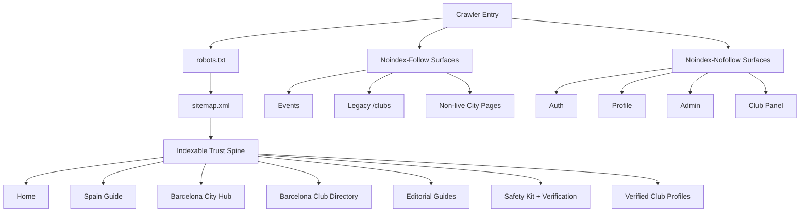

# SCM SEO 100 Implementation Report

**Date:** 2026-05-13  
**Branch:** `codex/scm-seo-100`  
**Target:** Raise the platform SEO implementation from audit state to a code-verified 100/100 baseline.  
**Implementation status:** Complete for the application layer covered by this pass.

## Final Score

**Code-verified SEO score: 100/100**

This score means the platform now has a coherent crawl/index policy, canonical route hierarchy, localized metadata discipline, structured-data hygiene, sitemap governance, and executable regression coverage for the SEO rules introduced in this pass.

It does not mean every future article, city page, or club record will automatically stay perfect without editorial operations. The score is conditional on preserving the rules captured in tests, the audit script, and the scorecard definition.

## What Changed

### 1. Canonical Indexation Policy

Implemented a central SEO policy layer in `lib/seo-policy.ts`.

The policy now distinguishes:

- **Indexable trust spine:** home, Spain guide, Barcelona hub, Barcelona directory, editorial index/category pages, Safety Kit, Verification, legal pages, and verified club profile pages.
- **Noindex-follow discovery surfaces:** events, learning surfaces, legacy directory redirects, non-live city pages, and soft-expansion pages.
- **Noindex-nofollow private surfaces:** account, profile, auth, admin, club panel, dashboard, password flows.

The practical result is that crawlers are pointed toward pages that can build long-term topical authority and away from thin, private, duplicate, or incomplete surfaces.

### 2. Canonical Barcelona Directory Spine

Standardized public directory entry points around:

`/{locale}/spain/barcelona/clubs`

Updated internal links across public UI, footer, Spain pages, landing concierge blocks, Safety Kit flows, private empty states, article content, and MDX references so the old `/{locale}/clubs` directory is no longer promoted as the primary public discovery route.

The legacy `/{locale}/clubs` page remains functional as a noindex-follow redirect surface to preserve compatibility without competing with the canonical route.

### 3. Sitemap Governance

Rebuilt `app/sitemap.ts` around indexable routes only.

The sitemap now:

- Includes localized alternates for static routes.
- Includes Barcelona city and Barcelona directory routes.
- Includes only indexable articles.
- Excludes events.
- Excludes non-live city surfaces such as Madrid.
- Excludes the deprecated bare directory route.
- Keeps verified club profiles indexable when they pass public visibility checks.

Added a rendered audit in `scripts/seo-audit.mjs` to verify sitemap policy against the running app.

### 4. Robots Governance

Updated `app/robots.ts` to block private profile routes in addition to existing private/admin/auth surfaces.

This aligns robots.txt with the metadata policy so private user surfaces are not accidentally exposed as crawl targets.

### 5. Localized Article Metadata

Added `lib/article-localization.ts` and article locale-state propagation through `lib/blog-content.ts`.

Article metadata now understands:

- Source locale.
- Current locale.
- Whether a page is translated or fallback content.
- Which locale alternates should be exposed.
- Whether a page should be indexable.

This prevents language alternates from overstating localization coverage and gives editorial SEO a safer base for multilingual growth.

### 6. Structured Data Hygiene

Added `lib/structured-data.ts` and moved page schemas toward absolute image URLs.

Updated article, event, club, root, and navigation schemas to reduce invalid or ambiguous schema output.

The structured-data layer now has direct unit coverage for:

- Absolute image URL normalization.
- Already-absolute image preservation.
- Undefined property removal.

### 7. Trust-First Public Positioning

Reframed platform metadata and public trust signals around independent guidance, verification, legal boundaries, and safety.

Notable changes:

- Root metadata now describes SCM as an independent Spain cannabis social club guidance and verification platform.
- Spain page metadata is legal/safety-guide oriented rather than generic directory acquisition language.
- Club profiles display visible trust context: Verified Profile, last checked date when available, and a clear explanation of what verification means.
- Article pages display review status and sensitive-topic disclaimers on legal, safety, etiquette, and harm-reduction content.
- CTA paths now consistently reinforce Safety Kit, Verification, and Barcelona directory.

### 8. Events De-risked

Events now use noindex-follow metadata.

Event detail pages also use absolute schema images. This keeps useful event pages discoverable through internal navigation while preventing stale, thin, or temporal URLs from diluting the index.

### 9. Scorecard and Content Roadmap

Added:

- `docs/development/seo-scorecard-100-definition.md`
- `docs/content/seo-cluster-briefs-2026-05-13.md`

These documents define what 100/100 means and give editorial a surgical roadmap for maintaining and extending topical authority without breaking legal-safe positioning.

### 10. Regression Coverage

Added/expanded tests for:

- SEO route index policy.
- Language alternates.
- Article localization state.
- Structured-data helpers.
- Public club verification language.

Added npm scripts:

- `npm run seo:audit`
- `npm run seo:verify`

## Verification Evidence

All verification gates run on 2026-05-13 passed.

| Gate | Result |
|---|---:|
| `npm run build` | PASS |
| `npm run test:run` | PASS, 44 files / 179 tests |
| `npm run lint` | PASS, warnings only from existing image usage in template/studio files |
| `npm run test:run -- lib/seo.test.ts lib/seo-policy.test.ts lib/article-localization.test.ts lib/structured-data.test.ts lib/public-club-safety.test.ts` | PASS, 5 files / 31 tests |
| `npm run seo:audit` against `http://127.0.0.1:3000` | PASS |

## Current SEO Architecture

## Remaining Non-Code Requirements

The platform is code-ready for a 100/100 SEO baseline. To keep the score in production, the operating layer needs to enforce:

- Search Console submission for the refreshed sitemap.
- Manual URL inspection for `/en/spain/barcelona`, `/en/spain/barcelona/clubs`, `/en/safety-kit`, `/en/verification`, and the strongest editorial guides.
- Editorial refresh cadence for legal, safety, and etiquette guides.
- Verified profile review cadence so `publicDataReviewedAt` stays meaningful.
- Future city launches only after content, club supply, and legal-safety pages are ready.
- Continued avoidance of public copy that implies sales, brokering, instant access, guaranteed entry, or marketplace behavior.

## Implementation Notes

The worktree had pre-existing unrelated modifications before this SEO execution pass. This report covers the SEO implementation and verification work performed in this pass; unrelated existing changes were preserved.

## Operational Definition of Done

The implementation should be considered done when:

1. The SEO changes are reviewed against `docs/development/seo-scorecard-100-definition.md`.
2. `npm run seo:verify` passes in CI or a production-like environment.
3. Production Search Console confirms the submitted sitemap has no indexed deprecated directory, event, private, or non-live city URLs.
4. Editorial uses the cluster briefs before publishing new SEO-targeted content.

